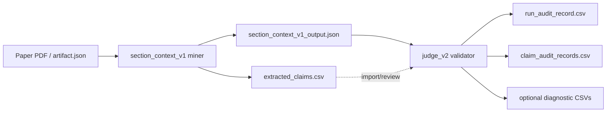
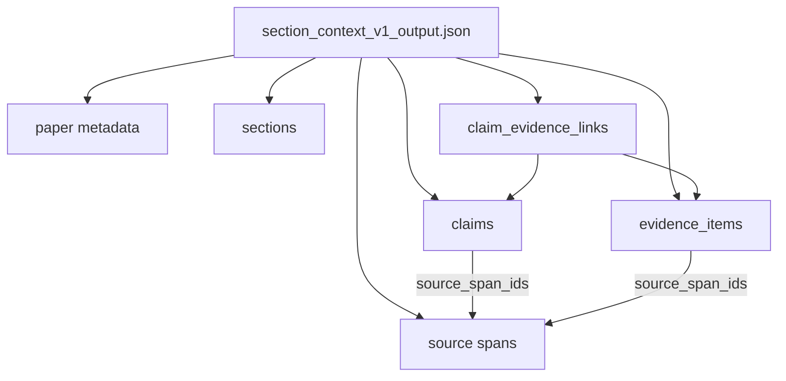
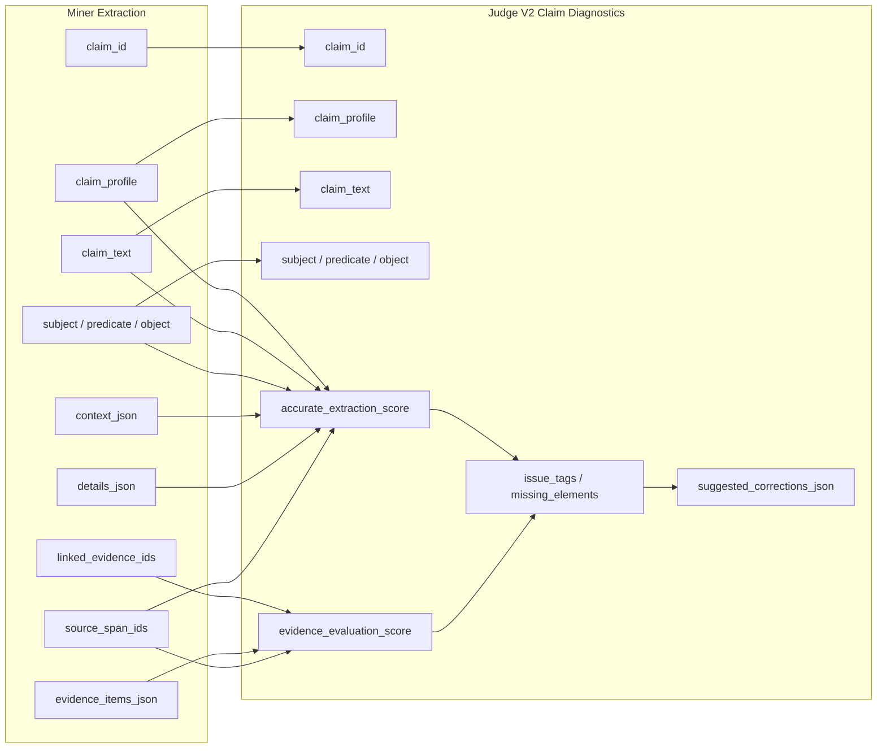
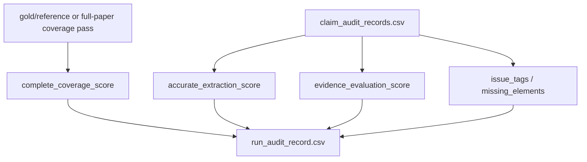
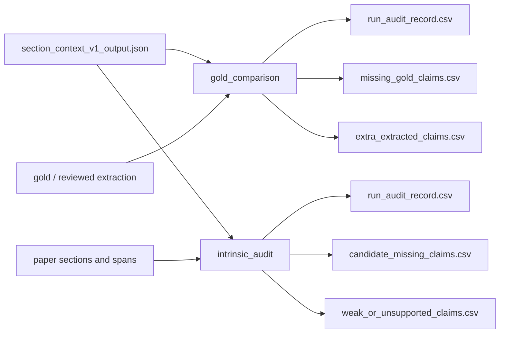

# Extraction and Audit Flow

This shows how `section_context_v1` extraction fields relate to `judge_v2` audit fields.

Source docs:

- `miner/section_context_v1/CLAIM_EXTRACTION_FIELDS.md`
- `validator/judge_v2/AUDIT_RECORD_FIELDS.md`

## High-Level Flow

## Extraction Objects

## Field Lineage

## Run-Level Audit

The validator keeps claim-level rows for debugging, but the main validator output is the run-level audit.

## Two Audit Modes

## Score Meaning

| Score | Gold mode | Intrinsic mode |
| --- | --- | --- |
| Run `complete_coverage_score` | Did extracted claims cover the gold/reference claims exhaustively? | In LLM mode, did extracted claims cover important claims found by a full-paper missing-claim discovery pass? |
| Run `accurate_extraction_score` | Did matched claims preserve the gold claim meaning and fields? | Are extracted claims faithful to their cited spans and profile/schema? |
| Run `evidence_evaluation_score` | Did extracted evidence match or sufficiently support the gold evidence? | Is evidence present, relevant, sufficient, and well-linked? |
| Claim `accurate_extraction_score` | Local diagnostic: does this claim match its gold/reference target? | Local diagnostic: is this claim faithful to its cited source span and schema? |
| Claim `evidence_evaluation_score` | Local diagnostic: does this claim's evidence align with gold/reference evidence? | Local diagnostic: does this claim's evidence support this claim? |

## Practical Rule

Use miner fields to answer:

> What did the miner extract, from where, and with what evidence?

Use validator fields to answer:

> How complete, accurate, and well-supported was that extraction?

The run-level audit is the validator's primary score. Claim-level rows are diagnostic: they explain local extraction and evidence problems, but they do not carry the holistic complete-coverage score.
