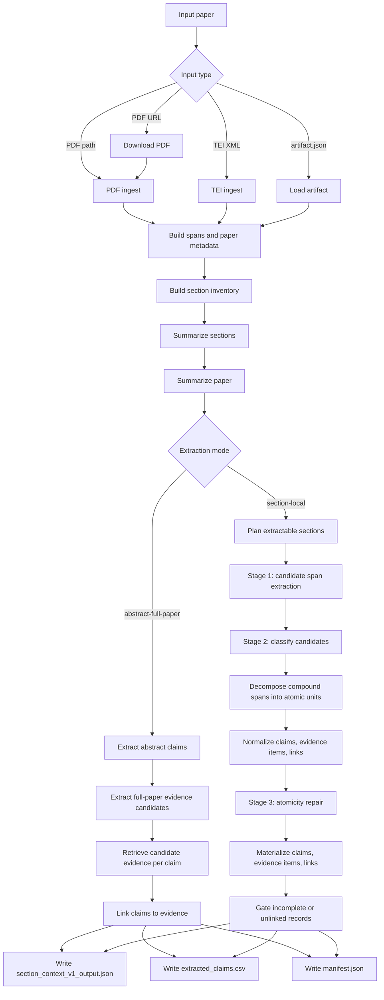
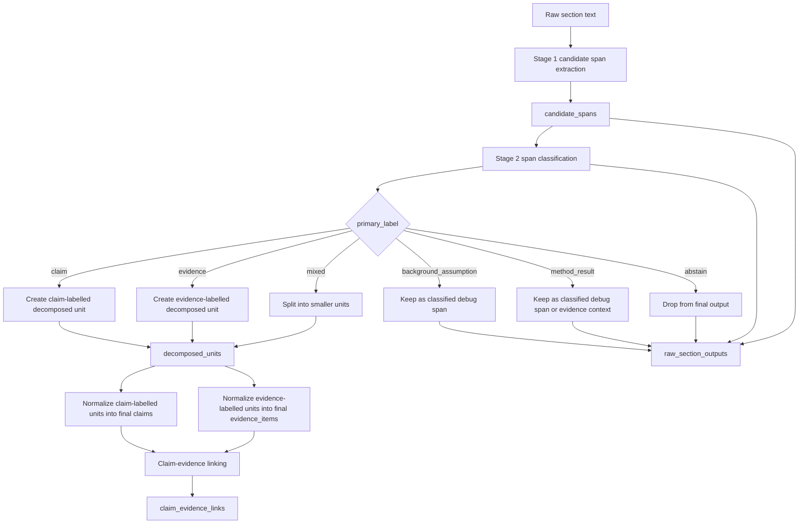
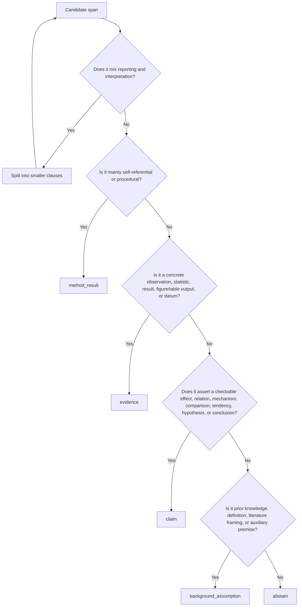

# Miner V0 Claim Extraction System

This document describes the `miner.v0` claim extraction system.

It covers:

- architecture
- staged claim/evidence extraction
- runtime inputs
- runtime outputs
- internal debug records

## Purpose

`miner.v0` is a claim-evidence extraction pipeline for the Claims subnet.

It supports two extraction modes:

- `section-local`: the original/default flow, where claims and evidence must come from the same selected section.
- `abstract-full-paper`: a claim-first flow, where contribution claims are extracted from the abstract and analyzed evidence is linked from non-abstract full-paper sections.

Its core design choices are:

- give the model whole-paper and section context before extraction
- extract only from one section at a time
- first identify raw candidate spans
- then classify candidate spans as claim, evidence, background/assumption, method/result, mixed, or abstain
- only then produce final claim-evidence pairs
- run a narrow atomicity repair pass over final claim-evidence pairs
- keep the final review output simple: claim text, evidence item text, links, and provenance

In `abstract-full-paper` mode, the claim/evidence boundary is different:

- the abstract is the only source for claim extraction
- extracted abstract claims must be contributions from this paper, not background, prior work, or generic motivation
- full-paper sections are searched for evidence candidates
- selected evidence candidates are analyzed into an evidence ledger before linking
- each abstract claim is retained even when evidence linking fails
- evidence items must still be grounded in raw full-paper section text and should introduce source-side information beyond claim restatement

This separates two decisions that are often conflated:

- what proposition is the paper asserting?
- what observation, statistic, result, or datum supports or evaluates that proposition?

## High-Level Architecture

```text
Input paper
  -> ingest as PDF / PDF URL / TEI XML / artifact.json
  -> build section inventory
  -> summarize each section
  -> summarize the paper from section summaries
  -> choose extraction mode
  -> section-local:
       -> plan which sections are worth extracting
       -> Stage 1: extract raw candidate spans from each eligible section
       -> Stage 2: classify candidates, split compound spans into decomposed units, normalize claims/evidence, and link them
       -> Stage 3: repair compound final claims into atomic claim-evidence pairs
  -> abstract-full-paper:
       -> extract contribution claims from the abstract
       -> extract evidence candidates from non-abstract sections
       -> retrieve candidate evidence per abstract claim
       -> analyze selected candidates into an evidence ledger
       -> link abstract claims to analyzed full-paper evidence items
  -> materialize claims / evidence items / claim-evidence links
  -> gate out incomplete or unlinked local claim-evidence objects in section-local mode
  -> write JSON + CSV outputs
```



## Main Code Path

The main runner is:

- `miner/v0/runner.py`

The extraction pipeline is composed of these stages:

1. `section_inventory.py`
   Builds section-level records from parsed spans.
2. `section_summary.py`
   Produces one structured summary per section.
3. `paper_summary.py`
   Produces one structured whole-paper summary from section summaries.
4. `section_gating.py`
   Decides which sections are worth extracting.
5. `section_claim_extractor.py`
   Runs candidate-span extraction, claim/evidence classification and linking, then atomicity repair.
6. `abstract_claim_extractor.py`
   In `abstract-full-paper` mode, extracts abstract claims, collects full-paper evidence candidates, retrieves candidates per claim, and links evidence to abstract claims.
7. `section_gating.py`
   Applies structural gating so unlinked claims/evidence are not exported.
8. `export.py`
   Writes final review-compatible artifacts.

## Staged Extraction Architecture

The actual v0 extraction happens in:

- `miner/v0/section_claim_extractor.py`

It runs two LLM calls per eligible section.

### Stage 1: Candidate Span Extraction

Prompt:

- `miner/v0/prompts/section_candidate_extraction_instructions.md`

The model receives:

- `paper_title`
- `paper_summary_json`
- `section_summary_json`
- `section_name`
- `section_type`
- `section_text`

It returns strict JSON:

```json
{
  "candidate_spans": [
    {
      "candidate_id": "c0",
      "source_text": "...",
      "initial_role_hint": "mixed",
      "reason": "..."
    }
  ]
}
```

Candidate spans are raw extraction units. They may be claims, evidence, background assumptions, method/result narration, or mixed spans that need splitting.

Stage 1 intentionally does not produce final claims.

### Stage 2: Classification, Splitting, and Linking

Prompt:

- `miner/v0/prompts/section_claim_extraction_instructions.md`

The model receives the same section context plus:

- `candidate_spans_json`
- `validation_feedback_json`

It returns strict JSON:

```json
{
  "classified_spans": [],
  "decomposed_units": [],
  "claims": [],
  "evidence_items": [],
  "claim_evidence_links": []
}
```

Stage 2 does five things:

1. Classifies each candidate span.
2. Splits mixed or compound spans when needed.
3. Emits split or unsplit atomic records as `decomposed_units`.
4. Normalizes claim-labelled decomposed units into final `claim_text`.
5. Normalizes evidence-labelled decomposed units into final `summary_text`.
6. Links each claim to direct evidence items.

### Stage 3: Atomicity Repair

Prompt:

- `miner/v0/prompts/section_atomicity_repair_instructions.md`

The repair stage receives:

- raw section text
- candidate spans
- classified spans
- decomposed units
- current claims
- current evidence items
- current claim-evidence links

It returns strict JSON:

```json
{
  "repair_actions": [],
  "claims": [],
  "evidence_items": [],
  "claim_evidence_links": []
}
```

This stage has a narrow job: detect compound final claims and return a complete repaired claim/evidence/link set for the section. If no repair is needed, it returns the original objects unchanged with a repair action explaining that no compound claims were found.

The stage is intentionally after normal extraction because compound claims are easiest to identify once final `claim_text`, evidence items, and links already exist.

## Abstract/Full-Paper Mode

The alternate mode is implemented in:

- `miner/v0/abstract_claim_extractor.py`
- `miner/v0/prompts/abstract_claim_extraction_instructions.md`
- `miner/v0/prompts/abstract_evidence_linking_instructions.md`

This mode runs after section inventory and paper summarization, but bypasses section planning and section-local claim extraction.

The stages are:

1. Locate an abstract section. GROBID TEI abstracts are parsed into spans with `section_type=ABSTRACT`; artifact inputs may provide those spans directly.
2. Extract all paper-owned claims made in the abstract. The abstract is the only claim source.
3. Run the existing candidate-span extractor across non-abstract sections to collect evidence-bearing full-paper candidates.
4. Use lexical retrieval to select a bounded set of candidates per abstract claim. The cap is controlled by `SUBNET_CLAIMS_ABSTRACT_EVIDENCE_CANDIDATE_LIMIT_PER_CLAIM` and defaults to `25`.
5. Link abstract claims to evidence items grounded in the selected candidates.
6. Export all abstract claims, including claims with no evidence links.

The important provenance distinction is:

- `claims[*].source_span_ids` point to the abstract.
- `evidence_items[*].source_span_ids` point to the full-paper evidence source.
- `claim_evidence_links` connect the abstract claim IDs to full-paper evidence IDs.

This mode is useful when the review target is "everything the abstract claimed" rather than "every section-local claim/evidence pair the paper makes."



## Classification Labels

`classified_spans[*].primary_label` uses:

| Label | Meaning |
| --- | --- |
| `claim` | A checkable proposition asserted by the paper. |
| `evidence` | An observation, measurement, statistic, figure/table output, estimate, or reported datum used to evaluate a claim. |
| `background_assumption` | Prior knowledge, definitions, literature framing, or auxiliary assumptions. |
| `method_result` | What the paper did, used, measured, constructed, or immediately observed without a broader inferential claim. |
| `mixed` | A span that bundles claim/evidence/background/method material and should be split. |
| `abstain` | A span that should not be converted into final v0 review output. |

Additional internal labels include:

- `rhetorical_role`
- `claim_subtype`
- `evidence_type`
- `modality`
- `polarity`
- `attribution`
- `confidence`

These are stored for debugging and validation, but the reviewer-facing output remains claim/evidence focused.

## Claim/Evidence Policy

The v0 rule is:

```text
Claim = what is being asserted.
Evidence = the information used to evaluate that assertion.
```

Examples:

```text
Source: X was associated with Y, suggesting X contributes to disease risk.
Claim: X contributes to disease risk.
Evidence: X was associated with Y.
```

```text
Source: Variant A and Variant B were associated with trait Y, with P values p1 and p2, respectively.
Claim: Variant A is associated with trait Y with P value p1.
Evidence: The section reports Variant A among the associations for trait Y, with P value p1.
Claim: Variant B is associated with trait Y with P value p2.
Evidence: The section reports Variant B among the associations for trait Y, with P value p2.
```

The model should not emit one bundled claim when the source contains multiple separable findings. It should also avoid making `evidence_items[*].summary_text` a polished duplicate of `claim_text`; evidence should preserve the source-side result, statistic, or observation.

`decomposed_units` make atomization explicit. If a candidate says "two loci", "A and B", "respectively", or contains multiple identifiers with distinct statistics, the model should emit one claim-labelled decomposed unit per separable item before final claim normalization.

The atomicity repair stage repeats this check on final `claim_text`. This catches cases where the main extractor correctly identified an important candidate but still emitted a bundled final claim.



## Runtime Inputs

At the pipeline level, `miner.v0` supports:

- PDF path
- downloadable PDF URL
- TEI XML
- `artifact.json`

At the extraction stage, the LLM receives:

- `paper_title`
- `paper_summary_json`
- `section_summary_json`
- `section_name`
- `section_type`
- `section_text`
- `candidate_spans_json` for Stage 2
- `validation_feedback_json` for Stage 2
For Stage 3, the LLM also receives the current claims, evidence items, links, and intermediate candidate/classification/decomposition records.

Summaries are orientation only. Claims and evidence must be grounded in raw section text.

In `abstract-full-paper` mode, the abstract-claim LLM receives:

- `paper_title`
- `paper_summary_json`
- `abstract_text`

The abstract-claim LLM must return contribution claims only. Background facts, prior-work statements, motivation, field consensus, and generic definitions are excluded unless the abstract frames them as this paper's own finding, estimate, method contribution, interpretation, or conclusion.

The evidence-analysis LLM receives:

- `paper_title`
- `paper_summary_json`
- `abstract_claims_json`
- `evidence_candidates_json`
- `validation_feedback_json`

The evidence-linking LLM receives:

- `paper_title`
- `paper_summary_json`
- `abstract_claims_json`
- `evidence_candidates_json` containing analyzed evidence candidates
- `validation_feedback_json`

In this mode, claims must be grounded in the abstract text, while evidence must be grounded in the provided full-paper evidence candidates. The evidence-analysis stage records `new_information`, `evidence_kind`, scope atoms, and `restatement_risk` so the linker can reject evidence that merely rewords a claim.

## Raw Output Contract

### `candidate_spans[*]`

Expected fields:

- `candidate_id`
- `source_text`
- `initial_role_hint`
- `reason`

### `classified_spans[*]`

Expected fields:

- `candidate_id`
- `source_text`
- `primary_label`
- `rhetorical_role`
- `claim_subtype`
- `evidence_type`
- `modality`
- `polarity`
- `attribution`
- `confidence`

### `decomposed_units[*]`

Expected fields:

- `unit_id`
- `source_candidate_ids`
- `unit_text`
- `primary_label`
- `rhetorical_role`
- `claim_subtype`
- `evidence_type`
- `modality`
- `polarity`
- `attribution`
- `confidence`

### `claims[*]`

Expected fields:

- `claim_text`
- `source_candidate_ids`
- `claim_subtype`
- `modality`
- `polarity`
- `attribution`
- `extractor_confidence`

Compatibility fields such as `subject`, `predicate`, and `object` may be present, but they are not required for v0 review output.

### `evidence_items[*]`

Expected fields:

- `role`
- `summary_text`
- `source_candidate_ids`
- `evidence_type`
- `rhetorical_role`
- `evidence_method`
- `outcome_type`
- `presentation_type`
- `extractor_confidence`

### `claim_evidence_links[*]`

Expected fields:

- `claim_index`
- `evidence_index`
- `relation`
- `confidence`

### `repair_actions[*]`

Expected fields:

- `action`
- `reason`
- `source_claim_index`, when applicable
- `new_claim_indexes`, when applicable

## Runtime Outputs

Each run writes a paper output directory containing:

- `artifact.json`
- `section_context_v1_output.json`
- `extracted_claims.csv`
- `manifest.json`
- `tei.xml`, when generated from GROBID

The main JSON output contains:

- `paper`
- `sections`
- `section_summaries`
- `paper_summary`
- `section_extraction_plan`
- `claims`
- `evidence_items`
- `claim_evidence_links`
- `raw_section_outputs`
- `pipeline_mode`, `abstract_claim_extraction`, and `abstract_evidence_linking` in `abstract-full-paper` mode

`raw_section_outputs` contains candidate spans, classified spans, decomposed units, atomicity repair actions, and pre-repair objects for debugging. It is useful for diagnosing whether a missed final claim was dropped during candidate extraction, span classification, decomposition, atomicity repair, linking, or structural gating.

In `abstract-full-paper` mode, `raw_section_outputs` is empty because section-local extraction is bypassed. Debugging records are stored under `abstract_claim_extraction` and `abstract_evidence_linking`.

## Reviewer-Facing Output

`extracted_claims.csv` remains the primary import file for ClaimsReview.

It contains:

- paper and section metadata
- `claim_text`
- linked evidence IDs
- evidence summary
- serialized evidence items
- serialized claim-evidence links

Internal span classification fields are not shown as first-class CSV columns.

## Design Notes

The v0 staged design follows a conservative extraction policy:

- label spans before generating final claims
- split mixed spans instead of forcing them into one record
- repair compound final claims after initial linking
- keep method/result and background material out of final claims unless the paper uses them as part of its own contribution
- preserve modality, polarity, attribution, and evidence type internally
- export a simple claim-evidence schema for review and validator scoring
