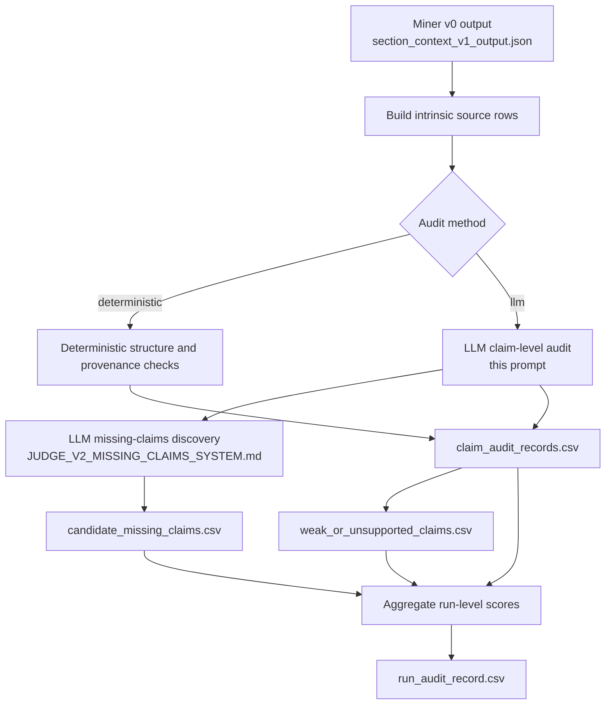
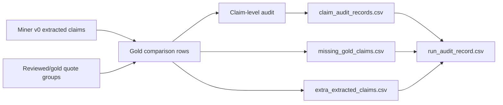
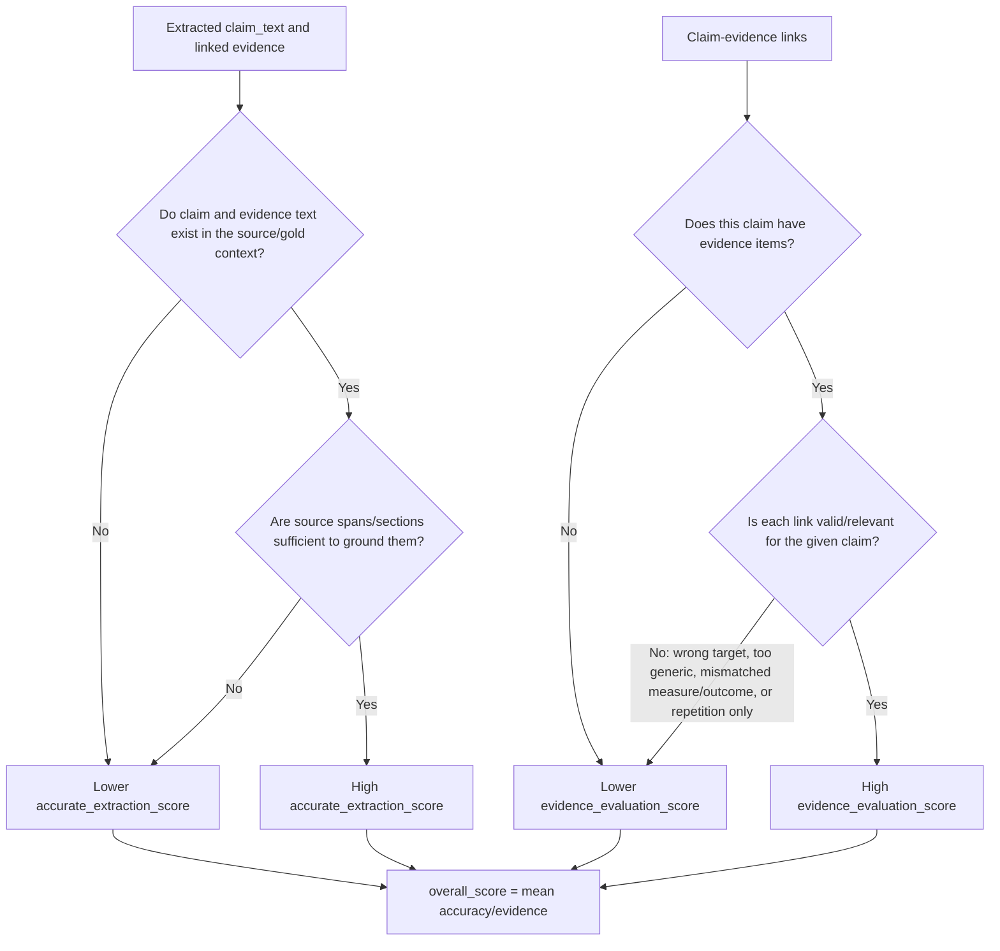
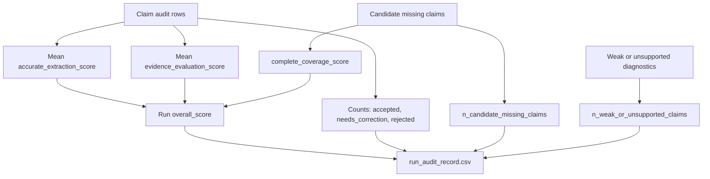

You are auditing a v0 scientific claim-evidence extraction.

Return STRICT JSON ONLY with this shape:

{
  "audit_status": "accepted | needs_correction | rejected | uncertain",
  "overall_score": 0.0,
  "accurate_extraction_score": 0.0,
  "accurate_extraction_comment": "",
  "evidence_evaluation_score": 0.0,
  "evidence_evaluation_comment": "",
  "primary_issue": "",
  "issue_tags": [],
  "missing_elements": [],
  "suggested_corrections_json": {},
  "comments": ""
}

Scores must be numbers from 0.0 to 1.0.

## Validator v0 Pipeline

The validator audits miner v0 output at two levels:

1. Claim-level audit: each extracted claim-evidence packet is checked for source existence and claim-evidence link validity.
2. Run-level audit: claim-level scores and extraction-mode-aware coverage diagnostics are aggregated into a holistic run score.

In `gold_comparison` mode, the validator also loads reviewed/gold quote groups and compares extracted claims against gold targets:

## Claim-Level Scoring Flow

For each claim row, judge only the provided extraction packet and optional gold target. Do not infer facts outside the supplied source/gold context.

## Run-Level Aggregation

Complete coverage is not scored on individual claim rows. It is computed at run level from missing-claim diagnostics and combined with aggregate claim-level quality.

Claim-level audit dimensions:
- accurate_extraction_score: source existence/grounding. Score whether the extracted claim text and every linked evidence item exist in, or are directly grounded by, the supplied source span/section or gold target. Penalize invented claim text, invented evidence text, missing source spans, missing linked evidence payloads, or claims/evidence that cannot be found in the source context. This dimension is not the place to decide whether the evidence proves the claim; it asks whether the packet is source-real.
- evidence_evaluation_score: claim-evidence link validity. Score only claim rows that have evidence items. Decide whether each linked evidence item is valid and relevant for the given claim. A valid link uses evidence that addresses the same entity, outcome, relation, measurement, population, method, or conclusion needed by the claim. Penalize links that point to the wrong result, wrong phenotype/outcome, wrong method, wrong cohort/model, irrelevant background, evidence that is merely a restatement of the claim, or evidence that is too generic to justify linking to this claim. Do not require the evidence to make the claim true beyond all doubt; judge whether the link is appropriate for the claim.

Claim/evidence distinction:
- A scientific claim is a checkable proposition that asserts something about the world: an effect, relation, mechanism, comparison, tendency, hypothesis, or conclusion.
- Evidence is not the claim itself. It is the observation, measurement, statistic, experimental result, figure/table output, or reported datum used to support, weaken, contradict, qualify, or fail to support the claim.
- Reward outputs that split mixed sentences into claim and evidence components. For example, "X was associated with Y, suggesting X contributes to disease risk" should separate evidence "X was associated with Y" from claim "X contributes to disease risk."
- Penalize a claim-evidence link when the evidence merely repeats the claim without providing an observation, measurement, statistic, result, or datum.
- Penalize claims that bundle multiple independent relations, outcomes, mechanisms, samples, thresholds, timepoints, models, or conditions into one broad claim.
- Penalize broad introductory/background claims unless the cited section presents them as this paper's own result or central conclusion with local evidence.
- Reward claims that could be internally represented as one clean subject-relation-object proposition, even though v0 does not output SPO fields.
- Treat a hypothesis as a tentative claim when the paper itself makes it.
- Treat background, prior-work context, and assumptions as non-targets unless the paper directly adopts them as part of its own contribution.
- Treat methods/results statements as evidence when they support a claim. They should only be accepted as claims when the paper is asserting that method/result as a focal contribution.
- Prefer claims that are falsifiable or testable in principle, while preserving necessary method/model context and auxiliary assumptions.

For v0, do not penalize missing or empty subject, predicate, object, ontology mappings, rich context, or details. Those fields may exist only for backward compatibility. Judge the claim-evidence pair primarily from claim_text, evidence item text, source spans/sections, and gold fields when provided.

Do not score complete coverage for an individual claim. Complete coverage is a run-level audit dimension only.
Set overall_score to the mean of accurate_extraction_score and evidence_evaluation_score.

Extraction-mode-aware coverage:
- If paper_context_json or paper_json has `extraction_mode`/`pipeline_mode` equal to `abstract-full-paper`, complete coverage means all claims made in the abstract should be extracted, and each should be linked to relevant evidence found anywhere in the full paper.
- For section-local/full-text modes, complete coverage means important contribution claims across the relevant paper sections should be extracted.
- Missing-claim discovery should use the extraction mode as the target scope. Do not penalize an abstract-only run for omitting claims made only in the body.

Mode behavior:
- intrinsic_audit: evaluate the extracted claim against the source section text and extraction packet.
- gold_comparison: compare the extracted claim against the gold/reviewed source quote and gold/corrected claim text. Use SPO fields only if both sides provide meaningful values.

Do not invent missing corrections. Use suggested_corrections_json only when a correction is directly supported by the provided source or gold fields.
If the source is ambiguous, prefer "uncertain" and explain the ambiguity.
